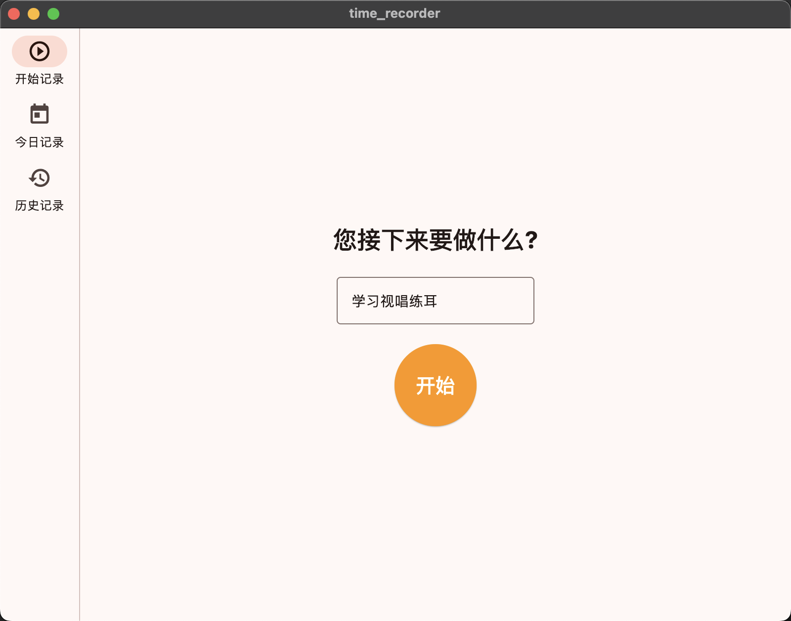
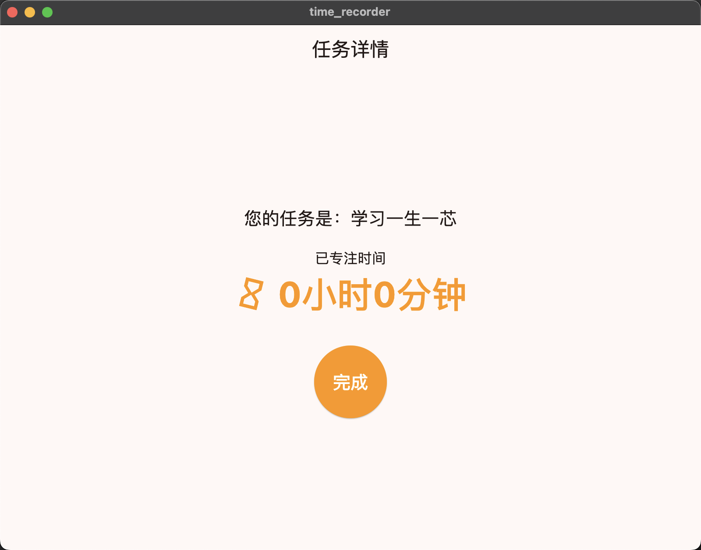
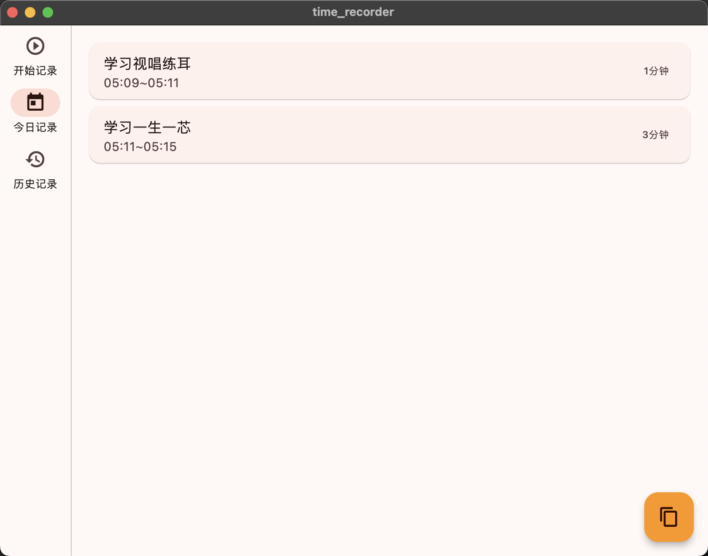
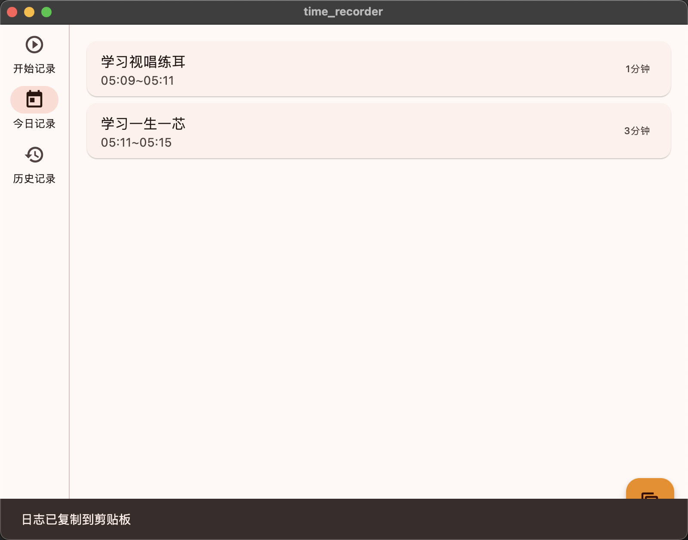
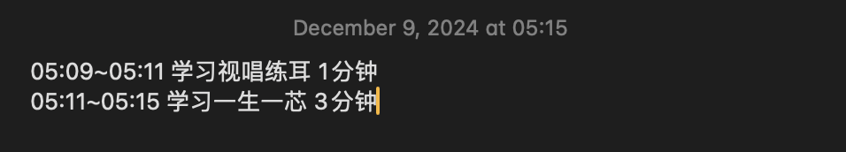

# time_recorder

A new Flutter project to record your time.

This project is assisted by Cursor, which really impressed me. I finished this project in about 6 hours and barely written any codes.

MacOS version and Windows version are both released.

## Screenshots

